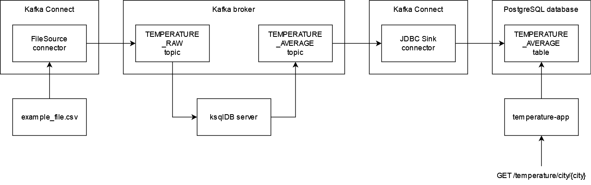

# Average Temperature app

The purpose of this application is to consume temperature measurements stored in a CSV file and calculate the year average for the cities for which the measurements are provided.

## Architecture

The application consists of two flows.

The first flow is used to read the contents of the file and store the aggregated results in the database. The temperature measurements file is read by the FileSource Kafka connector which pushes the contents of the file to the Kafka TEMPERATURE_RAW topic. The contents of this topic are processed by the ksqlDB server, which performs CSV format deserialization and aggregation of the temperature by city per year. The aggregated results are pushed to the TEMPERATURE_AVERAGE topic. TEMPERATURE_AVERAGE topic is consumed by the JDBC Sink Kafka connector, which updates the aggregated results in the PostgreSQL TEMPERATURE_AVERAGE table.

The second flow is used to present aggregated results to the user. This is performed by the Spring Boot web application, which exposes REST endpoint `GET /temperature/city/{city}`. The content of the response is read from the PostgreSQL TEMPERATURE_AVERAGE table.

## Running

To run the app you need the docker compose to be installed on your environment.

To run the average temperature app call the following instruction in the base folder of the app:

    docker compose up

The application may need up to ten minutes to be operable.

## The API

When the application is running, you can fetch the calculated average for the city by calling the `/temperature/city/{city}` endpoint. The REST API is attached to the 8080 port of the machine it's running on. To get the result of calculation for the city you can use following command, for example for Wrocław:

    curl localhost:8080/temperature/city/Wrocław
